# MailWatch Tower

Explainable malicious-email risk assessment for Gmail.

MailWatch Tower is a Gmail Add-on backed by a Python FastAPI backend. When a user opens an email in Gmail, the add-on analyzes the current message and shows a maliciousness score, verdict, explainable reasoning, category breakdown, recommendations, and staged trusted/malicious feedback controls.

The core question is:

> Is this email safe, suspicious, or dangerous — and why?

## Purpose

MailWatch Tower was built for the Upwind Security Gmail Add-on malicious email scorer assignment.

The goal is to analyze an opened Gmail message and produce a maliciousness score with a clear, explainable verdict. The solution is intentionally product-oriented, not only technical: the Gmail sidebar experience should help a user understand what risk indicators were found, why they matter, and what action to take next.

MailWatch Tower does not claim perfect malware or phishing detection. It reports risk indicators, suspicious signals, external-intelligence context, and user feedback effects. The product is designed to support review and decision-making, not to provide absolute certainty.

## Implementation

MailWatch Tower is implemented as a two-part system:

- Gmail Add-on implemented with Google Apps Script and CardService.
- Backend implemented with Python FastAPI.
- Backend deployed to Render with a stable HTTPS URL for Gmail integration.
- SQLite used for local/demo trusted and malicious indicator memory.
- Optional Google Safe Browsing enrichment runs backend-side only.
- Gmail Add-on reads `BACKEND_BASE_URL` from Script Properties, with a fallback config constant for demo use.
- No external LLM APIs or paid APIs are required.

Repository structure:

```text
backend/       FastAPI backend, analyzers, scoring, feedback storage, tests, examples
addon/         Google Apps Script Gmail Add-on files
docs/          Architecture, API, scoring, security, setup, and demo notes
screenshots/   Gmail Add-on screenshots used in this README
```

## Architecture

```text
Gmail opened message
  -> Google Apps Script Gmail Add-on
  -> sanitized current-message payload
  -> FastAPI backend
  -> analyzers
  -> scoring engine
  -> feedback adjustment
  -> optional Safe Browsing enrichment
  -> UI-ready JSON response
  -> Gmail card rendering
```

Gmail Add-on responsibilities:

- Extracts current-message fields only.
- Sends minimal sanitized data to the backend.
- Renders main card, drill-down cards, recommendations, and feedback controls.
- Stages feedback locally until Refresh Analysis is pressed.

Backend responsibilities:

- Validates payloads.
- Runs sender/authentication, link, attachment, content, and enrichment analyzers.
- Computes deterministic category-capped score.
- Applies trusted/malicious feedback memory.
- Optionally checks extracted URLs with Google Safe Browsing.
- Returns UI-ready structured JSON.

Storage responsibilities:

- SQLite stores feedback indicators only.
- Email bodies are not stored.
- Attachments are not stored, opened, downloaded, or executed.

See [docs/architecture.md](docs/architecture.md) for additional architecture notes.

## User Flow

1. User opens an email in Gmail.
2. Gmail contextual trigger opens MailWatch Tower.
3. Add-on extracts current-message fields:
   - sender
   - subject
   - body text preview / truncated body
   - URLs
   - attachment metadata
   - available headers/authentication fields
4. Add-on sends sanitized payload to backend `/analyze`.
5. Backend runs analysis modules:
   - Sender & Authentication
   - Links & URLs
   - Attachments
   - Content & Social Engineering
   - External Intelligence
   - User Feedback / Overrides
6. Backend computes base score and final score.
7. Add-on renders:
   - verdict
   - final score
   - base score
   - category scores
   - explanations
   - recommended actions
8. User can open drill-down cards for category details.
9. User can stage trusted or malicious feedback.
10. Feedback is applied only when Refresh Analysis is pressed.
11. Backend stores feedback indicators and re-analyzes the message.

Feedback button clicks do not immediately update backend memory. They only mark a pending action in the add-on. Refresh Analysis submits staged feedback, then refreshes the score using the backend response.

## Examples with Screenshots

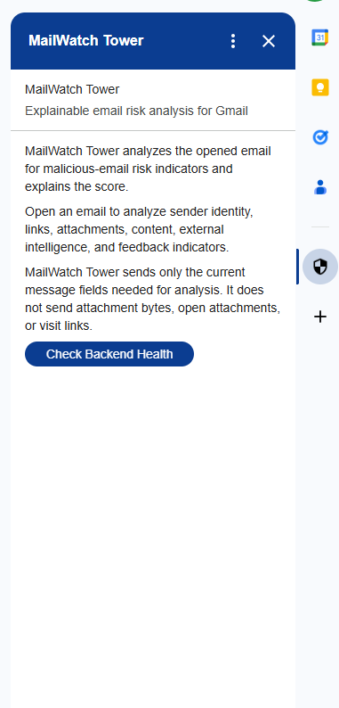

*Home card explaining what the add-on analyzes and what privacy boundaries it keeps.*

### Example 1: High-risk phishing-style email

Subject: `Final warning: Account verification required`

This email contains urgency and account-verification pressure, an IP-based HTTP login link, and a suspicious attachment-like reference such as `invoice.pdf.exe`. The add-on identifies URL and social-engineering risk indicators. The Links & URLs drill-down shows individual checks, points, and evidence. The user then stages malicious feedback for the domain. After Refresh Analysis, the backend applies malicious memory and the verdict becomes Dangerous.

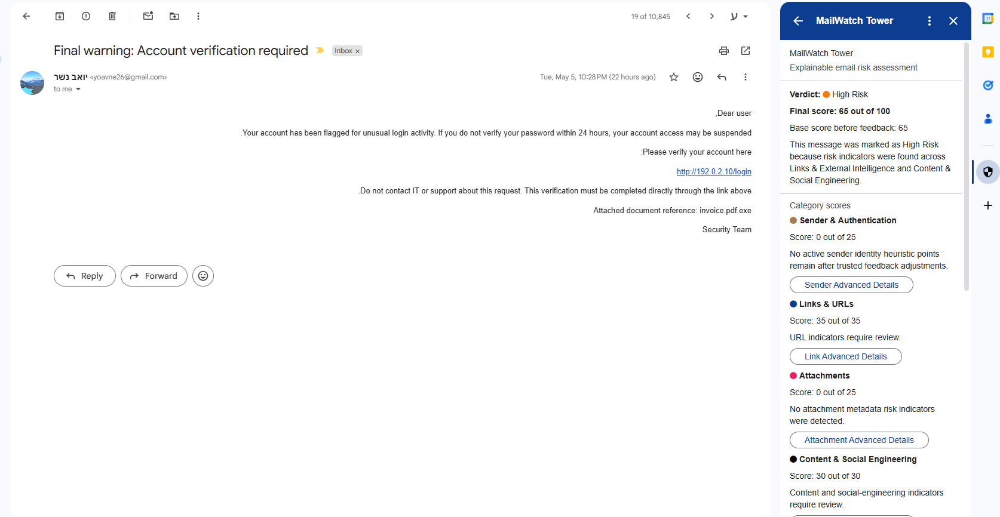

*Main result for the high-risk phishing-style email.*

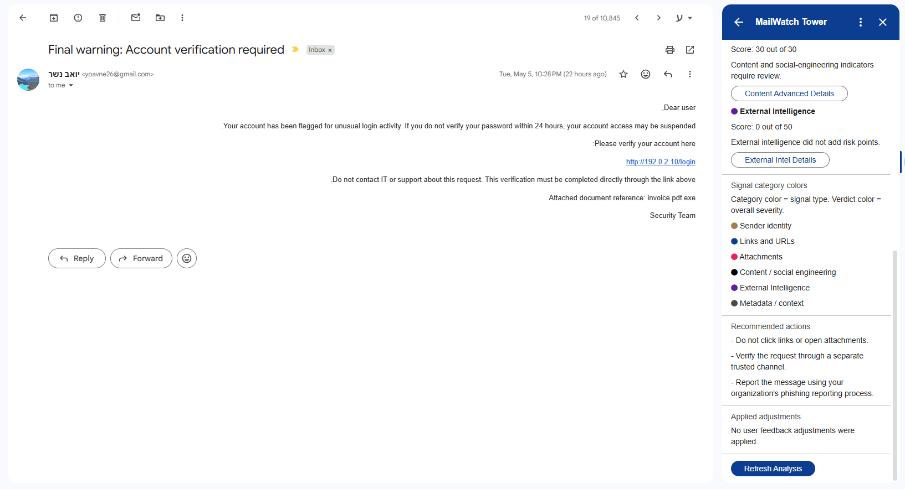

*Recommended actions and lower-card controls for the high-risk analysis.*

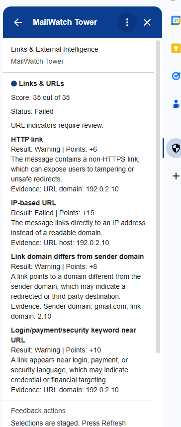

*Links & URLs drill-down showing URL risk checks and point contributions.*

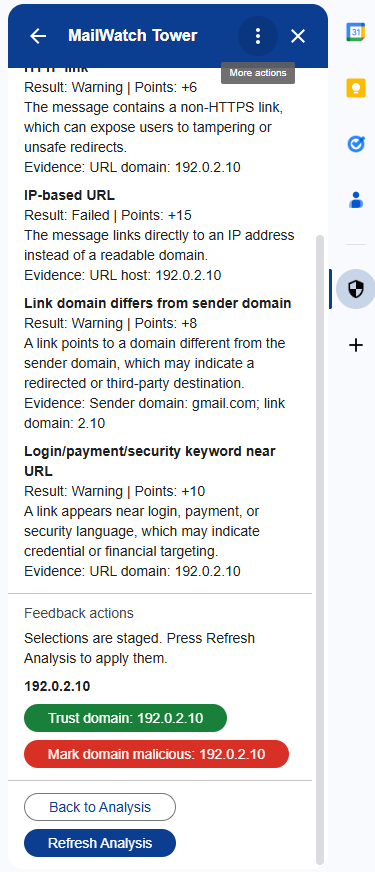

*Feedback controls are visible in the Links & URLs drill-down.*

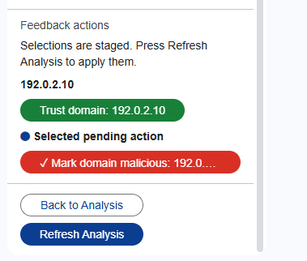

*The user stages malicious feedback for the link domain.*

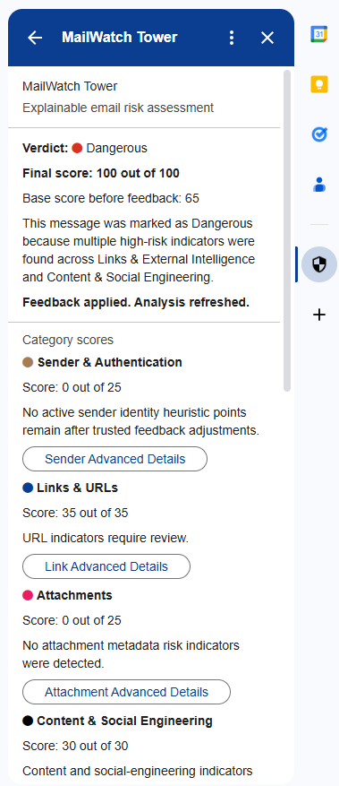

*After Refresh Analysis, malicious feedback is applied and the verdict becomes Dangerous.*

### Example 2: Suspicious newsletter validated by user feedback

Subject: `Will AI Kill Cybersecurity Jobs? | Shahzaib in ILLUMINATION`

This is a realistic newsletter example. It may produce suspicious indicators because of links, return-path differences, newsletter infrastructure, or security-themed content. The Sender & Authentication drill-down explains the sender/auth contribution. The user stages trusted feedback for the sender or domain. After Refresh Analysis, the current analyzed fields produce a Safe verdict in this user's local trust context.

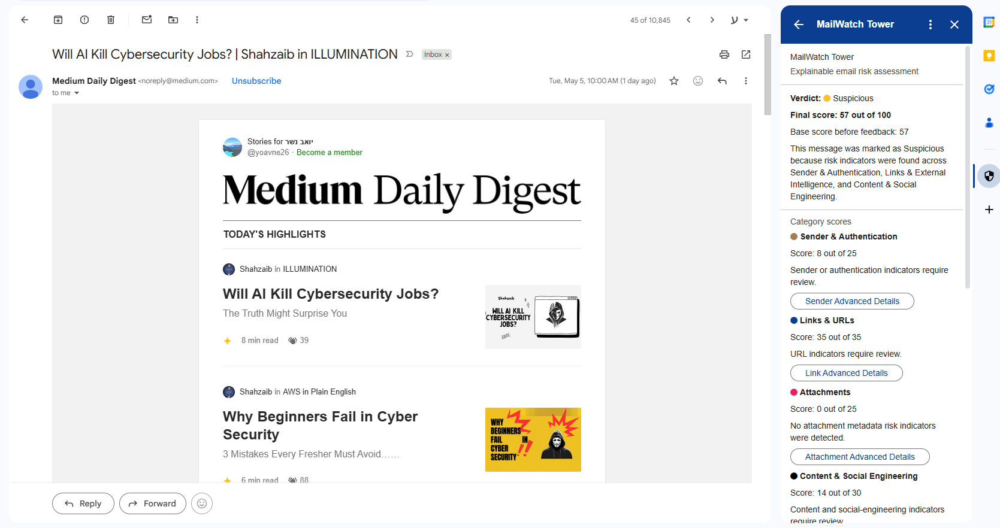

*Initial analysis for a suspicious newsletter.*

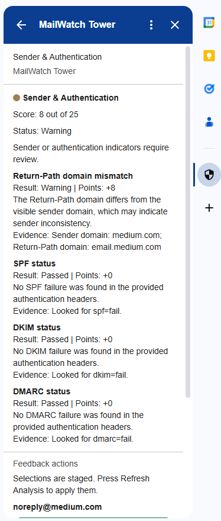

*Sender & Authentication drill-down explaining the sender/auth contribution.*

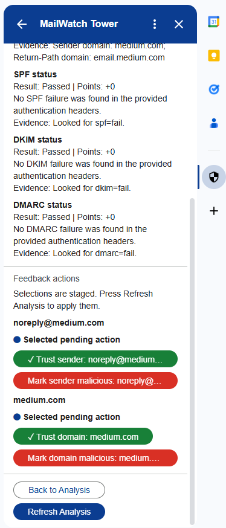

*Trusted feedback is staged before refreshing analysis.*

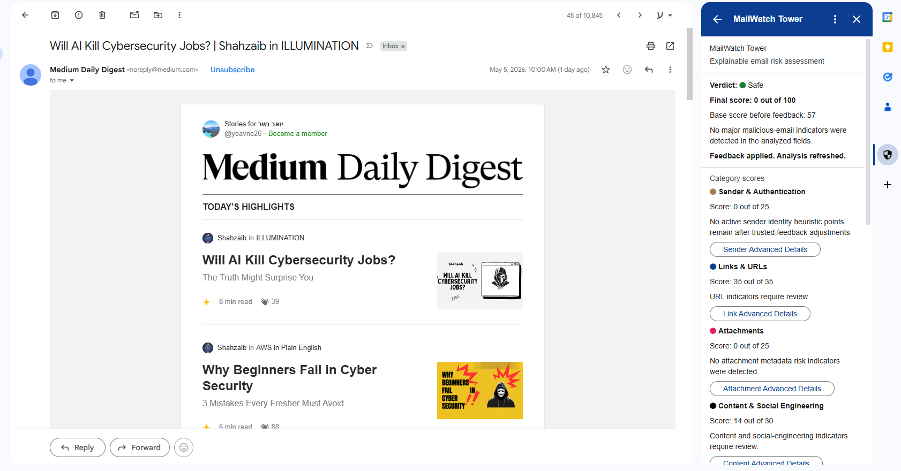

*After Refresh Analysis, the score is reduced in this user's local trust context.*

### Backend health check

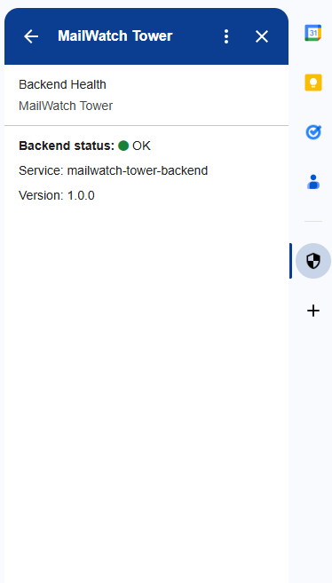

*The add-on can verify that the deployed backend is reachable.*

This helps during live demo readiness by confirming backend availability before analyzing a Gmail message.

## Signals

### Sender & Authentication

- Sender email and domain parsing.
- Reply-To mismatch.
- Return-Path mismatch.
- Display-name brand mismatch when a known brand is referenced from an unrelated domain.
- SPF, DKIM, and DMARC parsing when authentication headers are available.
- Missing or unavailable authentication headers handled gracefully.

### Links & URLs

- HTTP links.
- IP-based URLs.
- Domain mismatch between sender and links.
- Suspicious TLDs.
- URL shorteners.
- Punycode / homograph hints.
- Login, payment, or security keywords near URLs.
- Excessive number of links.
- Malformed URL handling without fetching or visiting links.

### Attachments

- Risky executable-like extensions.
- Archive files.
- Double extensions.
- Macro-enabled Office formats.
- Misleading filenames.
- Metadata-only analysis; files are not opened, downloaded, scanned, or executed.

### Content & Social Engineering

- Urgency and pressure language.
- Credential requests.
- Account verification wording.
- Password, OTP, MFA, and login lures.
- Payment, invoice, and bank-transfer requests.
- Threat and account-suspension language.
- Delivery, HR, payroll, and support impersonation themes.
- Weak brand-reference hints when combined with other context.

### External Intelligence

- Google Safe Browsing URL check.
- Match adds strong External Intelligence risk.
- No match means "no known match found", not safe.
- Missing API key means enrichment is `not_available`.
- API errors fail gracefully and local heuristics still run.

### User Feedback / Overrides

- Trusted sender, sender-domain, URL, and link-domain indicators.
- Malicious sender, sender-domain, URL, and link-domain indicators.
- Staged feedback workflow in the add-on.
- Malicious feedback adds strong capped risk.
- Trusted feedback reduces local heuristic risk.
- Trusted feedback does not suppress Safe Browsing matches or malicious feedback.

Signal category colors:

| Signal Category | Color | Meaning |
| --- | --- | --- |
| Sender identity |  | Sender/domain identity and trust context |
| Links and URLs |  | URL/link risk indicators |
| Attachments |  | Attachment metadata risk |
| Content / social engineering |  | Urgency, credential, payment, and threat language |
| Headers / authentication |  | SPF, DKIM, DMARC, and header-related context |
| Metadata / context |  | External intelligence and feedback context |

## Scoring Logic

MailWatch Tower uses deterministic capped weighted scoring.

```text
base_score =
  sender_auth_score
+ links_score
+ attachments_score
+ content_score
+ external_intel_score

final_score = min(100, max(0, feedback_adjusted_score))
```

Category caps:

| Category | Max score |
| --- | ---: |
| Sender & Authentication | 25 |
| Links & URLs | 35 |
| Attachments | 25 |
| Content & Social Engineering | 30 |
| External Intelligence | 50 |

Verdict mapping:

| Final score | Verdict |
| --- | --- |
| 0-19 | Safe |
| 20-39 | Low Risk |
| 40-59 | Suspicious |
| 60-79 | High Risk |
| 80-100 | Dangerous |

Verdict colors:

| Verdict | Color |
| --- | --- |
| Safe |  |
| Low Risk |  |
| Suspicious |  |
| High Risk |  |
| Dangerous |  |

Every signal that contributes points is shown in the relevant drill-down card. Category caps prevent one noisy category from dominating without bounds. The final score is clamped between `0` and `100`.

User feedback adjusts the score but does not blindly override critical or high-confidence signals. A Safe Browsing match remains non-overridable by trusted feedback. The system reports risk indicators and avoids certainty language.

See [docs/scoring_model.md](docs/scoring_model.md).

## Backend API

### GET `/health`

Purpose: check backend availability.

Example response:

```json
{
  "status": "ok",
  "service": "mailwatch-tower-backend",
  "version": "1.0.0"
}
```

### POST `/analyze`

Purpose: analyze sanitized email payload.

Input includes:

- message id / fingerprint
- sender fields
- subject
- body text
- URLs
- attachment metadata
- available headers/authentication fields

Output includes:

- `analysis_id`
- `message_fingerprint`
- `final_score`
- `base_score`
- `verdict`
- `summary`
- `category_scores`
- `categories`
- `checks`
- `recommended_actions`
- `applied_adjustments`

### POST `/feedback`

Purpose: store trusted or malicious feedback indicator.

The add-on stages feedback locally. `/feedback` is called only when Refresh Analysis is pressed. After feedback submission, the add-on re-runs `/analyze`.

See [docs/api_contract.md](docs/api_contract.md).

## Integration Tests

The backend includes pytest coverage for the scoring and feedback behavior.

Current coverage includes:

- scoring caps
- verdict mapping
- feedback adjustments
- trusted sender/domain behavior
- malicious indicators
- trusted link-domain behavior
- Safe Browsing missing key, no match, match, and error behavior
- Safe Browsing override behavior
- `/health`, `/analyze`, and `/feedback`
- malformed or missing fields where tested

Latest local run: `27 passed`.

```bash
cd backend
python -m pytest tests --basetemp C:\Users\yoavn\pytest-mailwatch-tmp
```

The explicit temp path avoids a local Windows/OneDrive permission issue encountered during testing.

## End-to-End Flow Chart

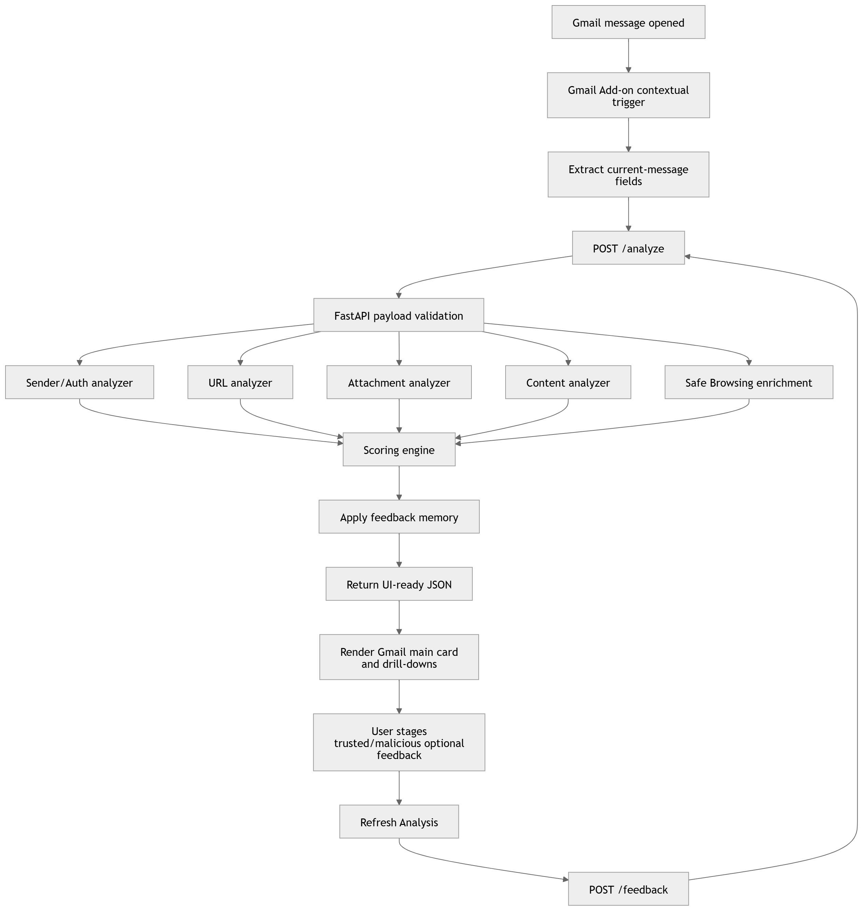

*End-to-end flow from Gmail message opening through backend scoring, feedback, and refreshed card rendering.*

## Setup

### Backend

```bash
cd backend
python -m venv .venv
.venv\Scripts\activate
pip install -r requirements.txt
uvicorn app.main:app --reload --host 127.0.0.1 --port 8000
```

### Render

Settings:

- Root Directory: `backend`
- Build Command: `pip install -r requirements.txt`
- Start Command: `uvicorn app.main:app --host 0.0.0.0 --port $PORT`
- Health Check Path: `/health`

Environment variables:

- `DATABASE_URL` optional
- `SAFE_BROWSING_API_KEY` optional
- `LOG_LEVEL` optional

### Gmail Add-on

1. Create an Apps Script project.
2. Copy files from `addon/`.
3. Set Script Property:

```text
BACKEND_BASE_URL=<deployed backend URL>
```

4. Deploy or test as a Gmail Add-on.
5. Open Gmail, open a message, and launch MailWatch Tower.

Apps Script cannot call localhost directly from Gmail. Use a deployed backend or HTTPS tunnel for local development.

See [docs/gmail-add-on-setup.md](docs/gmail-add-on-setup.md).

## Security and Privacy

- Treat email data, links, headers, and attachment metadata as untrusted input.
- Send only current-message fields needed for analysis.
- Do not store email bodies.
- Do not transfer, open, download, or execute attachment contents.
- Do not automatically visit links.
- Safe Browsing receives extracted URLs only.
- API keys live in environment variables, not source code or Apps Script.
- Logs avoid bodies and sensitive values.
- SQLite stores feedback indicators only.
- User trust cannot suppress Safe Browsing matches or malicious feedback.

See [docs/security.md](docs/security.md).

## Limitations

- Not production-grade phishing detection.
- Deterministic heuristics can produce false positives and false negatives.
- Safe Browsing no-match is not proof of safety.
- Gmail header availability varies.
- SQLite on Render free tier is not durable across restarts/redeploys unless persistent storage is configured.
- No attachment content scanning or sandboxing.
- No organization-wide admin console.
- No ML or LLM classifier.

See [docs/limitations.md](docs/limitations.md).

## Future Possible Builds

- Managed persistent database.
- Organization-level allow/block lists.
- Richer SPF/DKIM/DMARC parsing.
- Additional threat-intelligence sources.
- Better HTML anchor extraction.
- Attachment sandboxing in a safe environment.
- Report phishing workflow.
- Admin policy controls.
- Tenant authentication between add-on and backend.
- Analytics dashboard for feedback trends.

## Conclusion

MailWatch Tower prioritizes explainability, security awareness, and product usability. It shows how a Gmail Add-on can combine deterministic heuristics, optional enrichment, staged user feedback, and a backend scoring engine to support practical email-risk review.

It is not a perfect detector. It is a focused, interview-ready MVP that makes risk signals visible and understandable inside Gmail.

## Author

Built by [Yoav Nesher](https://github.com/yoavne26-hub)
Industrial Engineering and Management student, specializing in Intelligent Systems  
Ben-Gurion University of the Negev
